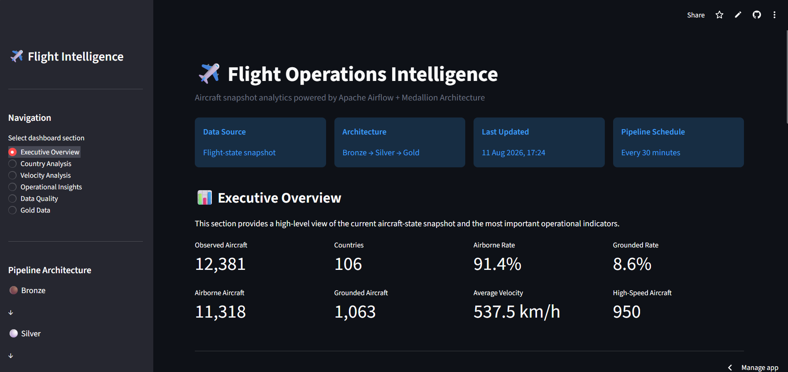
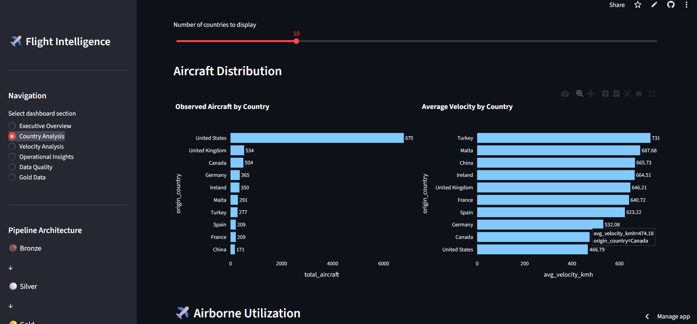
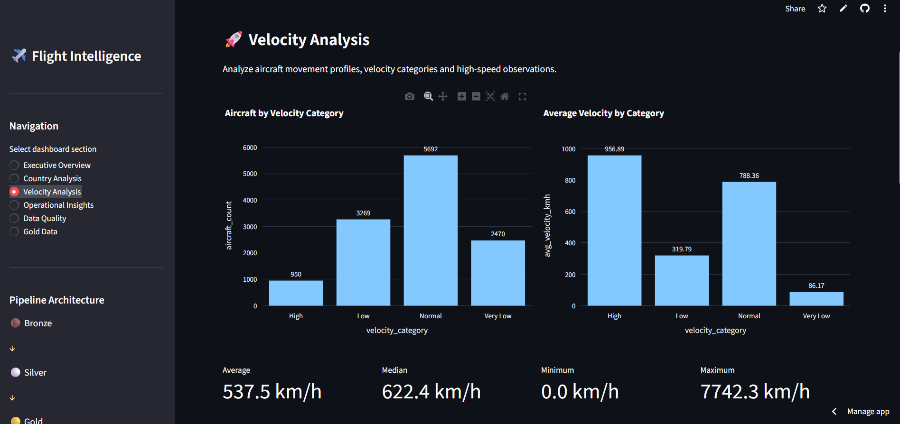
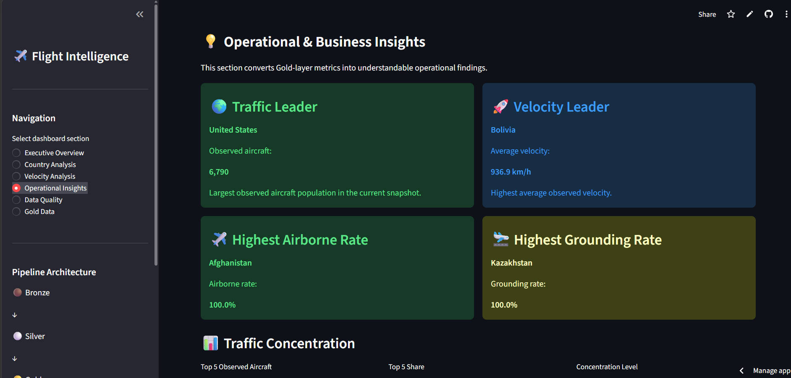
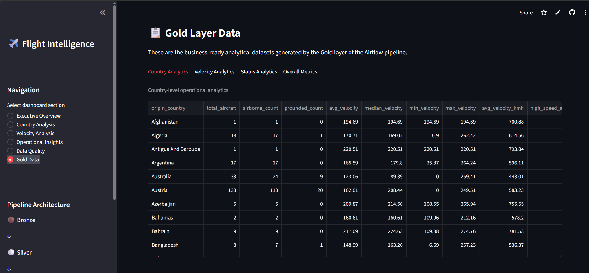

# ✈️ Flight Operations Intelligence

An end-to-end aircraft-state analytics project that ingests a live flight-state snapshot, transforms it through a Bronze → Silver → Gold Medallion pipeline, and presents business-ready results in an interactive Streamlit dashboard.

[🚀 Live Flight Operations Intelligence Dashboard](https://air-flow-project-7wpfx2ljyjaqzl8uuxt4f3.streamlit.app/)


This project demonstrates orchestration with Apache Airflow, reproducible containerised infrastructure, data cleaning and feature engineering with Pandas, analytical modelling, and dashboard delivery with Streamlit and Plotly.

> **Snapshot semantics:** metrics describe **observed aircraft** in an aircraft-state snapshot. An observed aircraft is **not** a completed flight, and the snapshot is not historical flight volume.

## Table of contents

- [Project overview](#project-overview)
- [Key features](#key-features)
- [System architecture](#system-architecture)
- [Medallion architecture](#medallion-architecture)
- [Bronze layer](#bronze-layer)
- [Silver layer](#silver-layer)
- [Gold layer](#gold-layer)
- [Airflow DAG](#airflow-dag)
- [Dashboard](#dashboard)
- [Data quality](#data-quality)
- [Project structure](#project-structure)
- [Technology stack](#technology-stack)
- [Local setup](#local-setup)
- [Airflow commands](#airflow-commands)
- [Streamlit deployment](#streamlit-deployment)
- [Security](#security)
- [Business analytics](#business-analytics)
- [Data limitations](#data-limitations)
- [Future improvements](#future-improvements)
- [Skills demonstrated](#skills-demonstrated)
- [Author](#author)

## Project overview

Flight Operations Intelligence processes the [OpenSky Network States API](https://opensky-network.org/api/states/all) response: a point-in-time collection of aircraft states. Airflow orchestrates ingestion and transformation; the Medallion layers retain raw input, produce a clean record-level dataset, and create aggregated analytical datasets. The Streamlit application reads the latest Gold CSVs and turns them into KPIs, charts, tables, and snapshot-based operational indicators.

The final output is an interactive analytical dashboard backed by four Gold datasets. `total_aircraft` is a count of unique `icao24` values in the cleaned snapshot—an observation count, not a count of completed flights.

## Key features

- Scheduled Apache Airflow pipeline running every 30 minutes.
- OpenSky flight-state ingestion to timestamped JSON Bronze files.
- Silver-layer validation, normalisation, deduplication, and feature engineering.
- Gold datasets for country, velocity category, operational status, and overall snapshot metrics.
- XCom-based hand-off of Bronze, Silver, quality-report, and Gold file paths.
- Docker Compose services for Airflow and its PostgreSQL metadata database.
- Cached Streamlit dashboard with Plotly charts, data-quality visibility, and Gold-data tabs.
- A deployed Streamlit dashboard that reads the Gold analytical datasets bundled with the application.

## System architecture

```text
OpenSky Network States API
          │
          ▼
Apache Airflow: flights_ops_medallion_pipe
          │
          ├── bronze_ingest
          │       └── data/bronze/flights_<UTC timestamp>.json
          ▼
      silver_transform
          ├── data/silver/flights_silver_<execution date>.csv
          └── data/silver/silver_quality_<execution date>.json
          ▼
       gold_analytics
          └── data/gold/*.csv
                  │
                  ▼
       Streamlit + Plotly dashboard
```

| Component | Role in this repository |
|---|---|
| OpenSky API | Supplies the raw aircraft-state snapshot. |
| Apache Airflow | Schedules and runs the three Python tasks, passing output paths through XCom. |
| Bronze storage | Keeps each API response as raw JSON under `data/bronze/`. |
| Silver storage | Holds cleaned record-level CSV data and a JSON quality summary under `data/silver/`. |
| Gold storage | Holds business-ready CSV aggregations under `data/gold/`. |
| PostgreSQL | Runs in Docker as Airflow's metadata database; the pipeline's Bronze/Silver/Gold datasets are CSV/JSON files, not PostgreSQL tables. |
| Docker Compose | Starts PostgreSQL, Airflow initialisation, the Airflow webserver, and the scheduler. |
| Streamlit + Plotly | Loads the newest Gold files, then renders analysis and data tables. |

## Medallion architecture

| Layer | Purpose | Input and processing | Output and reason |
|---|---|---|---|
| 🟤 Bronze | Preserve source fidelity. | OpenSky `/api/states/all` JSON response is written without record-level transformation. | `data/bronze/flights_<UTC timestamp>.json`; retains the raw source payload for traceability. |
| ⚪ Silver | Create a clean, typed, analysis-ready aircraft-state record set. | Reads Bronze JSON, selects relevant fields, validates velocity, normalises countries, converts booleans, deduplicates `icao24`, and adds derived fields. | `data/silver/flights_silver_<execution date>.csv` plus `silver_quality_<execution date>.json`; concentrates quality work before analytics. |
| 🟡 Gold | Produce dashboard-ready analytical aggregates. | Reads the Silver CSV and groups by country, velocity category, and flight status; also calculates one overall metrics row. | Four CSVs in `data/gold/`; avoids recomputing analytics in visualisation code. |

## Bronze layer

[`scripts/bronze_layer.py`](scripts/bronze_layer.py) calls `https://opensky-network.org/api/states/all` using `requests.get(..., timeout=30)` and raises HTTP errors with `response.raise_for_status()`. It serialises the complete JSON response to:

```text
/opt/airflow/data/bronze/flights_<YYYYMMDDHHMMSS>.json
```

The timestamp is generated in UTC. The directory is created when necessary. On success, the task pushes the file path to Airflow XCom under the key `bronze_file`. Network and HTTP failures surface as task failures through the `requests` exception / HTTP status handling; there is no custom retry logic in the script itself.

## Silver layer

[`scripts/silver_layer.py`](scripts/silver_layer.py) pulls `bronze_file` from the `bronze_ingest` task. It rejects missing paths, a Bronze JSON payload without `states`, and an empty `states` collection. The raw OpenSky state-vector array is given its documented positional field names, then the pipeline retains `icao24`, `origin_country`, `velocity`, and `on_ground`.

| Raw field | Silver treatment | Result |
|---|---|---|
| `icao24` | Cast to string, trimmed, lowercased; blank / null-like values removed; duplicates dropped with `keep="last"`. | Unique aircraft identifier per cleaned snapshot. |
| `origin_country` | Trimmed, null-like values replaced with `Unknown`, repeated whitespace collapsed, title-cased. | Normalised country dimension. |
| `velocity` | Converted to numeric; negative values set to null and null / invalid values removed. | Valid velocity in m/s. |
| `on_ground` | Converted from recognised string, numeric, boolean, or missing values to a boolean. | Operational-state flag. |

The transformation derives:

- `flight_status`: `Grounded` when `on_ground` is true; otherwise `Airborne`.
- `velocity_category`: `Very Low` (≤50 m/s), `Low` (>50–150 m/s), `Normal` (>150–250 m/s), or `High` (>250 m/s).
- `velocity_kmh`: `velocity × 3.6`, rounded to two decimals.
- `is_high_speed`: `velocity > 250` m/s.
- `is_airborne`: logical inverse of `on_ground`.

It saves a country-sorted CSV as `data/silver/flights_silver_<execution date>.csv` and writes `data/silver/silver_quality_<execution date>.json`. The quality report includes input/output records, duplicates removed, missing ICAO24 removals, countries filled as `Unknown`, airborne records, grounded records, and high-speed records. Both output paths are pushed to XCom as `silver_file` and `silver_quality_file`.

## Gold layer

[`scripts/gold_layer.py`](scripts/gold_layer.py) retrieves `silver_file` from the `silver_transform` task, validates the expected Silver columns, coerces numeric velocities, and converts CSV boolean representations before aggregation. All Gold files are date-named using the Airflow execution date and are written to `data/gold/`.

| Dataset | Grain | Important columns | Dashboard use / question answered |
|---|---|---|---|
| `country_flight_analytics_<date>.csv` | One row per `origin_country` | Counts, velocity statistics in m/s and km/h, high-speed count, airborne/grounded percentages, traffic and velocity ranks | Country comparison, leaders, utilisation, grounding, high-speed, and traffic-versus-velocity views. |
| `velocity_analytics_<date>.csv` | One row per `velocity_category` | `aircraft_count`, average velocity (m/s and km/h), airborne/grounded counts, `percentage` | Velocity-category distribution and average speed charts. |
| `flight_status_analytics_<date>.csv` | One row per `flight_status` | `aircraft_count`, average velocity (m/s and km/h), `percentage` | Airborne-versus-grounded charts. |
| `overall_flight_metrics_<date>.csv` | One snapshot-level row | Aircraft/country counts, status counts/rates, velocity statistics, km/h average, high-speed count | Executive and velocity KPIs. |

The Gold task publishes paths as `gold_file`, `gold_country_file`, `gold_velocity_file`, `gold_status_file`, and `gold_overall_file` through XCom.

## Airflow DAG

[`dags/flight-pipeline.py`](dags/flight-pipeline.py) defines the DAG `flights_ops_medallion_pipe`.

| Setting | Value |
|---|---|
| Schedule | `*/30 * * * *` (every 30 minutes) |
| Start date | 11 August 2026 |
| Catchup | `False` |
| Owner | `airflow` |
| Retries | `0` |
| Operators | Three `PythonOperator` tasks |

```text
bronze_ingest
     │  XCom: bronze_file
     ▼
silver_transform
     │  XCom: silver_file, silver_quality_file
     ▼
gold_analytics
     └── XCom: Gold dataset file paths
```

## Dashboard

[`dashboard/app.py`](dashboard/app.py) locates the most recently modified CSV matching each Gold filename pattern and loads all four datasets with `@st.cache_data(ttl=60)`. If a required Gold dataset is missing, it shows an error and the command to trigger the Airflow DAG.

| Section | What it provides |
|---|---|
| Executive Overview | Snapshot metadata, core KPIs, operational-status charts, top countries, and a snapshot interpretation. |
| Country Analysis | Adjustable top-country display, observed-aircraft and average-velocity charts, airborne and grounding rates, and a country-performance table. |
| Velocity Analysis | Velocity-category charts, four velocity KPIs, high-speed counts by country, and a traffic-versus-velocity scatter plot. |
| Operational Insights | Snapshot leaders, top-five traffic concentration, concentration level, and generated key findings. |
| Data Quality | Bronze/Silver/Gold file counts, the Silver-layer quality process, and Gold dataset sizes. |
| Gold Data | Tabular access to Country, Velocity, Status, and Overall Metrics datasets. |

### Executive overview



The executive page displays Observed Aircraft, Countries, Airborne Rate, Grounded Rate, Airborne Aircraft, Grounded Aircraft, Average Velocity in km/h, and High-Speed Aircraft. It also renders airborne-versus-grounded charts and the top countries by observed aircraft. These KPIs describe the loaded snapshot only.

### Country analysis



The page compares selected top countries by observed aircraft and average velocity in km/h. It also provides airborne utilisation, grounding-rate charts, and a sortable country performance table containing counts, percentages, velocity, high-speed count, and ranking fields.

### Velocity analysis



This view charts aircraft count and average velocity by Silver-derived velocity category, then shows average, median, minimum, and maximum velocity KPIs. The average comes from the Gold km/h field; median, minimum, and maximum originate in m/s and are converted to km/h for display. It also includes high-speed aircraft by country and a scatter plot of observed aircraft volume against average km/h velocity.

### Operational & business insights



The dashboard calculates the Traffic Leader (largest observed aircraft count), Velocity Leader (highest country average km/h), Highest Airborne Rate, Highest Grounding Rate, top-five observed-aircraft total and share, and a concentration level: High at ≥60%, Moderate at ≥40%, otherwise Low. Its automatic findings restate these snapshot indicators. They are analytical observations, not causal business conclusions.

### Gold data



The Gold Data page exposes the business-ready output tables in four tabs: **Country Analytics**, **Velocity Analytics**, **Status Analytics**, and **Overall Metrics**.

## Data quality

Data quality is performed in Silver rather than in the dashboard so every downstream Gold aggregate is based on one consistent, validated record set. The implemented process:

- removes invalid or blank ICAO24 values and deduplicates on `icao24`;
- fills missing country values with `Unknown`, normalises whitespace, and title-cases country names;
- converts velocity to numeric, invalidates negative velocity, and removes null/invalid velocities;
- converts `on_ground` to a boolean;
- derives flight status, velocity category, km/h velocity, high-speed, and airborne indicators; and
- records summary counts in a Silver quality-report JSON file.

## Project structure

```text
Air-flow project/
├── .env                         # Local environment variables; ignored by Git
├── .gitignore
├── docker-compose.yml
├── requirements.txt
├── README.md
├── dags/
│   └── flight-pipeline.py
├── dashboard/
│   └── app.py
├── scripts/
│   ├── __init__.py
│   ├── bronze_layer.py
│   ├── silver_layer.py
│   └── gold_layer.py
├── data/
│   ├── bronze/                  # Runtime raw snapshots; ignored by Git
│   ├── silver/                  # Runtime cleaned data / quality reports; ignored by Git
│   └── gold/                    # Current analytical CSV outputs
├── docs/
│   └── images/
│       ├── executive-overview.png
│       ├── country-analysis.png
│       ├── velocity-analysis.png
│       ├── operational-insights.png
│       └── gold-layer-data.png
├── logs/                        # Airflow runtime logs; ignored by Git
└── plugins/
```

## Technology stack

| Technology | Purpose |
|---|---|
| Python | Pipeline tasks and dashboard implementation. |
| Apache Airflow 2.9.3 | Scheduled orchestration and XCom-based task hand-offs. |
| Docker / Docker Compose | Local Airflow and PostgreSQL service environment. |
| PostgreSQL 15 | Airflow metadata database. |
| Requests | OpenSky HTTP ingestion. |
| Pandas | Data cleaning, transformation, and aggregation. |
| Streamlit | Interactive dashboard. |
| Plotly | Dashboard charts. |

## Local setup

Prerequisites: Git, Python, Docker Desktop (with Docker Compose), and an available local port `8080` for Airflow. The project uses `.env` for Docker Compose variables; keep your local values private.

```powershell
git clone <your-repository-url>
cd "Air-flow project"

python -m venv .venv
.venv\Scripts\Activate.ps1
pip install -r requirements.txt

docker compose up -d
docker compose ps
```

After the Airflow services are ready, open `http://localhost:8080`, confirm `flights_ops_medallion_pipe` is visible, and trigger it from the UI or the command below. Then run the dashboard from the repository root:

```powershell
streamlit run dashboard\app.py
```

The dashboard looks for Gold files beneath `data\gold`. A fresh pipeline run produces date-named Gold files there.

## Airflow commands

The Docker Compose file explicitly names the relevant containers `airflow-scheduler`, `airflow-webserver`, and `airflow-postgres`.

```powershell
docker compose ps
docker exec airflow-scheduler airflow dags list
docker exec airflow-scheduler airflow dags list-import-errors
docker exec airflow-scheduler airflow dags trigger flights_ops_medallion_pipe
```

To view the web UI, use `http://localhost:8080`. The administrator credentials are configured through local `.env` variables and must not be committed.

## Streamlit deployment

The dashboard is available at [Live Flight Operations Intelligence Dashboard](https://air-flow-project-7wpfx2ljyjaqzl8uuxt4f3.streamlit.app/). The Streamlit app consumes Gold analytical CSV files available to the deployed application.

The repository's Docker Compose configuration runs Airflow locally; it does not define a cloud-hosted Airflow deployment or a direct cloud connection between Airflow and Streamlit. Refreshing local Gold data does not by itself update the separately deployed Streamlit app—its deployed files must be updated through the dashboard's deployment workflow.

## Security

- Never commit `.env` or `.env.*`; these may contain database and Airflow administrator credentials.
- Keep `.streamlit/secrets.toml`, `.venv/`, `logs/`, temporary Python artefacts, and Airflow local files out of version control. The supplied `.gitignore` already covers these categories.
- Do not put passwords, API tokens, or private connection strings in source code, screenshots, or documentation.

## Business analytics

This snapshot supports questions such as:

- How many aircraft are observed, and how many countries are represented?
- What share of observed aircraft is airborne versus grounded?
- Which countries have the most observed aircraft, the highest airborne rate, the highest grounding rate, or the highest average velocity?
- How concentrated is observed aircraft activity among the top five countries?
- What does the velocity-category distribution look like, and where are high-speed observations concentrated?

## Data limitations

- This is snapshot data, not historical flight volume.
- Observed aircraft are not equivalent to completed flights.
- A single snapshot cannot establish trends, seasonality, or causality.
- Grounded state does not necessarily indicate maintenance, delay, or an operational problem.
- High velocity does not automatically imply risk.
- Country-level observations depend on source coverage and the availability of state data at the snapshot time.

## Future improvements

Potential extensions to the current design include:

- retaining historical snapshots for time-series analysis;
- adding automated Gold refresh and a persistent cloud data store;
- adopting cloud object storage and a production Airflow deployment;
- adding data-quality alerts, pipeline monitoring, and CI/CD validation;
- introducing anomaly detection after historical baselines exist; and
- adding dashboard authentication and access controls where required.

## Skills demonstrated

- Data engineering and ETL/ELT design
- Apache Airflow workflow orchestration
- Docker and PostgreSQL-backed local infrastructure
- Python, Requests, and Pandas data processing
- Data cleaning, validation, and feature engineering
- Medallion data modelling and analytical aggregation
- Business-oriented snapshot analytics
- Streamlit and Plotly data visualisation
- Git/GitHub documentation and deployment readiness

## Author

**Vivek Kumar**  
B.Tech — Smart Manufacturing  
IIITDM Jabalpur
